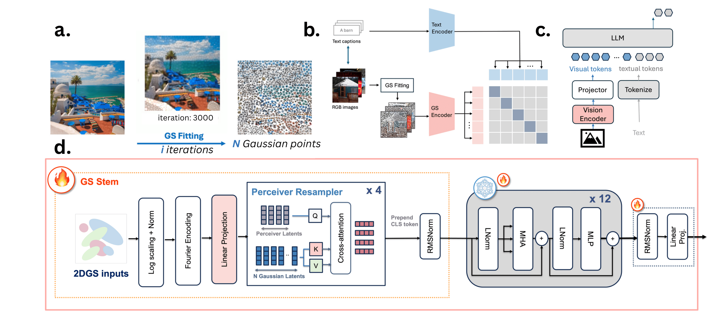

# GaussianVision: Vision-Language Alignment from Compressed Image Representations using 2D Gaussian Splatting

**Yasmine Omri, Connor Ding, Tsachy Weissman, Thierry Tambe**  
📧 Correspondence: yomri@stanford.edu  

[](https://arxiv.org/abs/2509.22615)

---

<p align="center">
  
</p>

---

Modern vision-language pipelines are driven by RGB vision encoders trained on massive image-text corpora. While these pipelines have enabled strong zero-shot capabilities and transfer, they inherit two structural inefficiencies from the pixel domain:

- **High transmission cost** from edge to cloud  
- **Exploding sequence length** from patch-based tokenization  

We explore **2D Gaussian Splatting (2DGS)** as an alternative visual substrate: a compact, spatially adaptive representation that models images as colored anisotropic Gaussians.

### Key Contributions
- 🚀 **Scalable 2DGS pipeline** with structured initialization, luminance-aware pruning, and batched CUDA kernels  
- ⚡ CUDA codebase for up to **90× faster fitting** with ~97% GPU utilization  
- 🧠 **CLIP adaptation for 2DGS** using a lightweight splat-aware stem, training only 9.7–13.8% of total CLIP parameters 
- 📊 **Competitive zero-shot performance** on 38 datasets and on **visual question answering (VQA) tasks upon integration in a VLM**  
- 📦 Over **3×–23.5× compression** of inputs vs RGB inputs  

Our results establish 2DGS as a viable multimodal substrate, highlighting a path toward **semantically rich yet transmission-efficient representations** for edge-cloud learning.

---

## 📢 News
- 🚧 **[Coming soon]** Code, models, and datasets

---

## 📄 Citation
```bibtex
@article{omri2025gaussianvision,
  title={GaussianVision: Vision-Language Alignment from Compressed Image Representations using 2D Gaussian Splatting},
  author={Omri, Yasmine and Ding, Connor and Weissman, Tsachy and Tambe, Thierry},
  journal={arXiv preprint arXiv:2509.22615},
  year={2025}
}